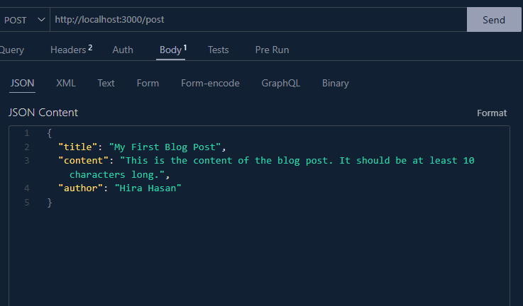
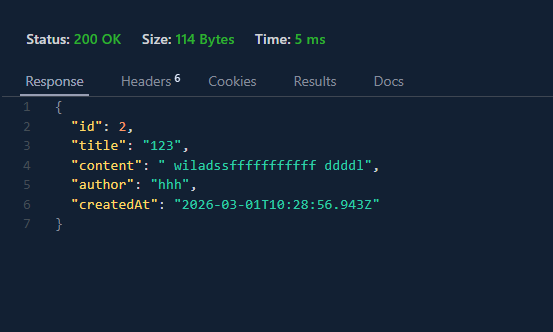

# Explaining how to run this Blog Post API

## Instalation

- Type "npm i" in your project folder. Make sure node is already installed.
- type node -v to check your versions. if no versions is apear than install node.

## Tables

| Task              |          Route name           |
| ----------------- | :---------------------------: |
| Creating a post   |  http://localhost:3000/post   |
| Read a post by id | http://localhost:3000/posts/2 |

## Post Request

## Post Response

## Get Resonse

